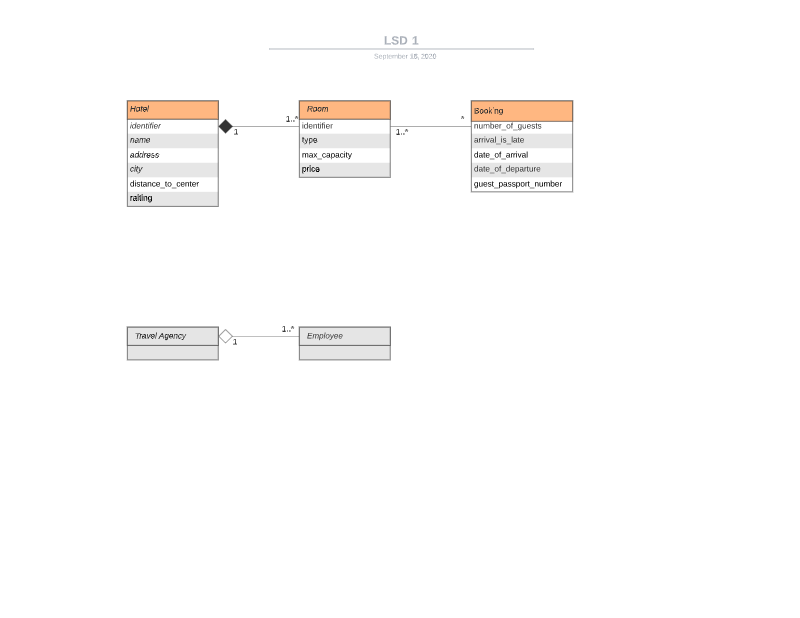

### LogicalDataModel

### Nouns 
|Names |LDM   | Explenation |
|------|:----:|-------------|
|Hotel | x |             |
|Holiday|-||
|System|-||
|Rooms | x ||
|Web-Servive|-||
|Third part solution|||
|Employees| x ||
|Travel-Agency| ? ||
|Agrement| ? ||
|Identification| x  |by 8 letters, the first two letters should be ISO_3166 country code and the last five characters are a 6 didgit number|
|Hotel-Name| x ||
|Adresse| x |||
|distence| x ||
|Cities| x ||
|Rating| x ||
|Room-Number| x ||
|Room-Code| x | 1 to 4 digits followed by an optional letter from a-z|
|Room-accomodatom| x |max number of guest|
|Room-Type| x |types: 'S'single, 'D' double, 'T' twin2, 'F' family, and 'M' meeting room|
|Prices| x |Price per room|
|Passport_Number| x |guest identifacation|
|Bookings| x |1 or more guest. Booking can include one or more rooms. Number of guest not > then max capacity of room|
|Bookings-nights| x ||
|Late arrival| x ||
|Capacity-Room| x ||
|Meetingrooms| x |Meeting rooms can only be booked in connection with a stay, the capacity of the meeting rooms can not be used for accommodation.|
### Verbs

|Names            |LDM           | Explenation |
|-----------------|:------------:|-------------|
|Identified |-|
|Invole one or more guest|-|
|Include more than one room|-|
|May not be greater than|-|
|Only be booked in connection with a stay|(x)|
|Can not be used for accommodation|-|
|Should be marked with "late arrival"|-|
|Tasks should be handled by the web application|-|
|Show a list of vacant hotel rooms|x|
|Should include hotel information and type of rooms|-|
|Make a booking|x|
|Include af meeting room|x|
|An error message should be returned|-|
|See a booking (passport)|x|
|Cancel a booking (passport)|x|

## Main Use Case

### Agency employee makes a booking

Main Success Scenario: 
Agency employee makes successfull booking through an booking api.

Prime actor: Travel agency employee / thrird part solution users
Secondary Actor: NONE

1. Actor can get a list of vacant hotel rooms in a given city for a given number of guests and period of time.
2. Actor can make a booking for up to 9 persons in one or more rooms for a given period of time on a given day
3. See booking

* * *

Secondary Scenario Nr. 1:
Pre-conditions: 
Agency employee cancell a booking. 

1. Actor can get a list of vacant hotel rooms in a given city for a given number of guests and period of time.
2. Actor can make a booking for up to 9 persons in one or more rooms for a given period of time on a given day
3. Actor makes a booking of a meeting room
4. See booking

Secondary Scenario Nr. 2:
Pre-conditions: Must have a booking
Agency employee cancell a booking. 

1. Actor finds booking
2. Actor cancels the booking
